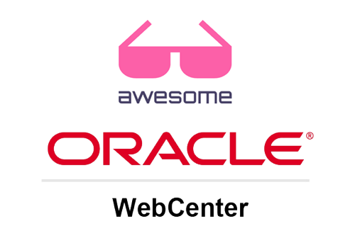

   
  
   
   

# Awesome Oracle Webcenter (Content, Portal, Sites & Cloud) 
A curated list of awesome things related to Oracle WebCenter

- [Get Started](#get-started)
- [Resources](#resources)
  - [Official Resources](#official-resources)
  - [Samples](#samples)
- [Video](#video)
  - [Video Channels](#video-channels)
- [Blogs](#resources)
  - [Official Blogs](#official-blogs)
  - [Developer Blogs](#developer-blogs)
  - [Partner Blogs](#partner-blogs)
- [GitHub](#github)

# Get Started
- [WCC Overview](https://www.oracle.com/uk/content-management/webcenter-content/)
- [Documentation](https://docs.oracle.com/en/middleware/webcenter/index.html)

# Resources

### Official Resources
- [Release Notes](https://docs.oracle.com/en/cloud/paas/webcenter-content/webcenter-content-marketplace/)
- [WCC REST API](https://docs.oracle.com/en/cloud/paas/webcenter-content/webcenter-content-api/index.html)
- [WCC Patching](https://docs.oracle.com/en/cloud/paas/webcenter/webcenter-marketplace/index.html)
- [SaaS/Fusion Integration WCC](https://docs.oracle.com/en/cloud/paas/webcenter-content/extend-objects/#configure-webcenter-content-for-fa-integration)
- [WCC Downloads](https://www.oracle.com/uk/middleware/technologies/webcenter-content-download.html)
- [Critical Patch Updates](https://support.oracle.com/epmos/faces/DocumentDisplay?_afrLoop=380143690838522&id=2806740.2&_afrWindowMode=0&_adf.ctrl-state=17rskpx345_4)
- [Redwood UI](https://docs.oracle.com/en/cloud/paas/webcenter-content/use-redwood-ui/index.html#introduction)

### Components
- [HowToComponents11g Tutorials](https://github.com/JohnRSim/awesome-webcenter/tree/main/components/HowToComponents-11g)

# Video

### Video Channels
 - [Updates](https://asktom.oracle.com/) Search for WebCenter or PM Office Hours
 - [YouTube](https://www.youtube.com/@OracleLearning/search?query=webcenter) Learning Centre

# Blogs

# Official Blogs
- [PM | Mandar Tengse](https://blogs.oracle.com/authors/mandar-tengse)
- [SE | Tania Tavkar](https://blogs.oracle.com/authors/tania-tavkar)
- [PM | Vinay Kumar](https://blogs.oracle.com/authors/vinay-kumar)
- [FB | Tim Gruidl](https://blogs.oracle.com/authors/tim-gruidl)
- [PM | Sachin Kaura](https://blogs.oracle.com/authors/sachin-kaura)
- [TS | Piyush Garg](https://blogs.oracle.com/authors/piyush-garg)
- [OC | Vinit Kini](https://blogs.oracle.com/authors/vinit-kini)

# Developer Blogs
- [BitmapBytes - Oracle Cloud Innovation](https://bitmapbytes.com)

# Partner Blogs
- [Fishbowl Solutions](https://fishbowlsolutions.com/blog)

## Contribute

Contributions welcome! Read the [contribution guidelines](contributing.md) first.

## License

To the extent possible under law, John Sim has waived all copyright and
related or neighboring rights to this work.

